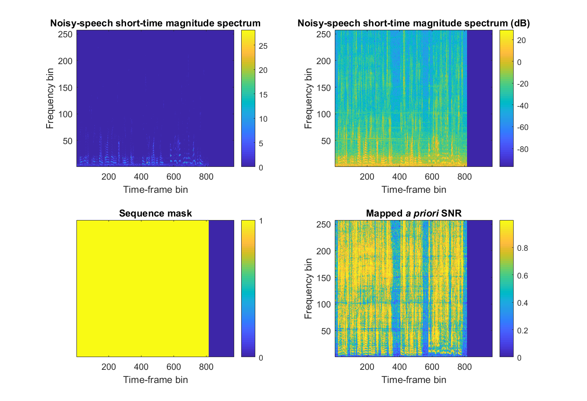
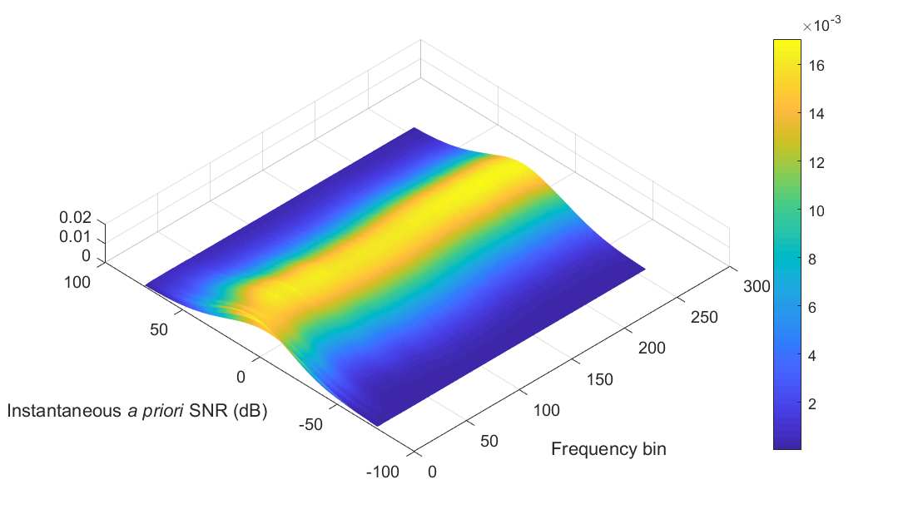
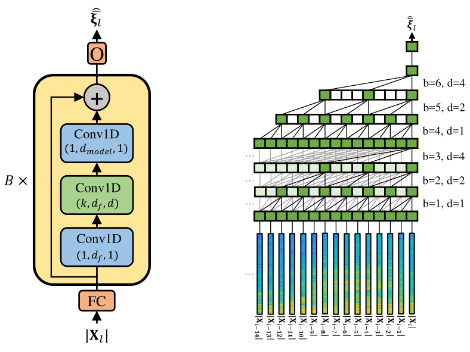

<!---

export PATH=/usr/local/cuda-10.1/bin${PATH:+:${PATH}}
export LD_LIBRARY_PATH=/usr/local/cuda-10.1/lib64${LD_LIBRARY_PATH:+:${LD_LIBRARY_PATH}}

-->

Deep Xi has been updated to Tensorflow 2!
====

Deep Xi: *A Deep Learning Approach to *A Priori* SNR Estimation.*
====

Deep Xi is implemented in TensorFlow 2 and is used for speech enhancement, noise estimation, for mask estimation, and as a front-end for robust ASR.
----
[Deep Xi](https://doi.org/10.1016/j.specom.2019.06.002) (where the Greek letter 'xi' or ξ is pronounced  /zaɪ/) is a deep learning approach to *a priori* SNR estimation that was proposed in [[1]](https://doi.org/10.1016/j.specom.2019.06.002) and is implemented in [TensorFlow 2](https://www.tensorflow.org/). Some of its use cases include:


* It can be used by minimum mean-square error (MMSE) approaches to **speech enhancement** like the MMSE short-time spectral amplitude (MMSE-STSA) estimator.
* It can be used by minimum mean-square error (MMSE) approaches to **noise estimation**, as in *DeepMMSE* [[2]](https://ieeexplore.ieee.org/document/9066933).
* Estimate the ideal binary mask **(IBM)** for missing feature approaches or the ideal ratio mask **(IRM)**.
* A **front-end for robust ASR**, as shown in **Figure 1**.

||
|----|
| <p align="center"> <b>Figure 1:</b> Deep Xi used as a front-end for robust ASR. The back-end (Deep Speech) is available <a href="https://github.com/mozilla/DeepSpeech">here</a>. The noisy speech magnitude spectrogram, as shown in <b>(a)</b>, is a mixture of clean speech with <i>voice babble</i> noise at an SNR level of -5 dB, and is the input to Deep Xi. Deep Xi estimates the <i>a priori</i> SNR, as shown in <b>(b)</b>. The <i>a priori</i> SNR estimate is used to compute an MMSE approach gain function, which is multiplied elementwise with the noisy speech magnitude spectrum to produce the clean speech magnitude spectrum estimate, as shown in <b>(c)</b>. <a href="https://github.com/anicolson/matlab_feat">MFCCs</a> are computed from the estimated clean speech magnitude spectrogram, producing the estimated clean speech cepstrogram, as shown in <b>(d)</b>. The back-end system, Deep Speech, computes the hypothesis transcript, from the estimated clean speech cepstrogram, as shown in <b>(e)</b>. </p> |


How does Deep Xi work?
----
A training example is shown in **Figure 2**. A deep neural network (DNN) within the Deep Xi framework is fed the **noisy-speech short-time magnitude spectrum** as input. The training target of th DNN is a mapped version of the instantaneous *a priori* SNR (i.e. **mapped *a priori* SNR**). The map for a frequency component is the cumulative distribution function (CDF) of the instantaneous *a priori* SNR, as given by Equation (13) in [1](https://doi.org/10.1016/j.specom.2019.06.002). The statistics for the CDF are computed over a sample of the training set. An example of the statistics for each frequency bin (mean and standard) are shown in **Figure 3**. 

The **sequence mask** is used by TensorFlow to ensure that the DNN is not trained on the padding.

During inference, the *a priori* SNR estimate is computed from the mapped *a priori* SNR using Equation (12) from [2](https://ieeexplore.ieee.org/document/9066933).

||
|----|
| <p align="center"> <b>Figure 2:</b> <a> A training example for Deep Xi.</a> </p> |
 
 ||
|----|
| <p align="center"> <b>Figure 3:</b> <a> Distribution of the instantaneous *a priori* SNR in dB for each frequency bin for the sample.</a> </p> |

Which audio do I use with Deep Xi?
----
Deep Xi operates on mono/single-channel audio (not stereo/dual-channel audio). Single-channel audio is commonly due to most cell phones using a single microphone. The available trained models operate on a sampling frequency of `f_s=16000`Hz, which is currently the standard sampling frequency used in the speech enhancement community. The sampling frequency can be changed in `run.sh`. Deep Xi can be trained using a higher sampling frequency (e.g. `f_s=44100`Hz), but this is unnecessary as human speech rarely exceeds 8 kHz (the Nyquist frequency of `f_s=16000`Hz is 8 kHz). The available trained models operate on a window duration and shift of `T_d=32`ms and `T_s=16`ms. To train a model on a different window duration and shift, `T_d` and `T_s` can be changed in `run.sh`. Currently, Deep Xi supports `.wav`, `.mp3`, and `.flac` audio codecs. The audio codec and bit rate does not affect the performance of Deep Xi. 

Where can I get a dataset for Deep Xi?
----
Open-source training and testing sets are available for Deep Xi on IEEE *DataPort*:

Deep Xi Training Set: [http://dx.doi.org/10.21227/3adt-pb04](http://dx.doi.org/10.21227/3adt-pb04).

Deep Xi Test Set: [http://dx.doi.org/10.21227/h3xh-tm88](http://dx.doi.org/10.21227/h3xh-tm88).

Test set from the original [Deep Xi paper](https://doi.org/10.1016/j.specom.2019.06.002): [http://dx.doi.org/10.21227/0ppr-yy46](http://dx.doi.org/10.21227/0ppr-yy46).

The MATLAB scripts used to generate these sets can be found in [`set`](https://github.com/anicolson/DeepXi/tree/master/set).


<!-- ||
|----|
| <p align="center"> <b>Figure 3:</b> <a> ResLSTM </a> <i> a priori</i>  <a> SNR estimator.</a> </p> |

||
|----|
| <p align="center"> <b>Figure 4:</b> <a> ResBLSTM </a> <i> a priori</i>  <a> SNR estimator.</a> </p> |
 -->

Current Models
-----
The ResLSTM and ResBLSTM networks used for Deep Xi in [1] have been replaced with a residual network (ResNet) that employs [causal dilated convolutional units](https://arxiv.org/pdf/1803.01271.pdf), a type of [temporal convolutional network (TCN)](https://arxiv.org/pdf/1803.01271.pdf). Deep Xi-ResNet can be seen in **Figure 2**. The full model comprises of 2 million parameters, utilises 40 bottlekneck blocks, and has a maximum dilation rate of 16. This provides a contextual field of approximately 8 seconds.

||
|----|
| <p align="center"> <b>Figure 2:</b> <a> <b>(left)</b> Deep Xi-ResNet with <i>B</i> bottlekneck blocks. Each block has a bottlekneck size of <i>d_f</i>, and an output size of <i>d_model</i>. The middle convolutional unit has a kernel size of <i>k</i> and a dilation rate of <i>d</i>. The input to the ResNet is the noisy speech magnitude spectrum for frame <i>l</i>.  The output is the corresponding mapped <i>a priori</i> SNR estimate for each component of the noisy speech magnitude spectrum. <b>(right)</b> An example of Deep Xi-ResNet with <i>B=6</i>, a kernel size of <i>k=3</i>, and a maximum dilation rate of <i>4</i>. The dilation rate increases with the block index, <i>b</i>, by a power of 2 and is cycled if the maximum dilation rate is exceeded.</a></p> |

<!--
Trained models for **c2.7a** and **c1.13a** can be found in the *./model* directory. The trained model for **n1.9a** is to large to be stored on github. A model for **n1.9a** can be downloaded from [here](https://www.dropbox.com/s/wkhymfmx4qmqvg7/n1.5a.zip?dl=0).
-->

Availability
-----
<!--
A trained network for version **3e** will be made available within the next couple of weeks.
-->

A trained model for version **3f** can be found in the [*./model* directory](https://github.com/anicolson/DeepXi/tree/master/model).


Results
-----
Objective scores obtained on the test set described [here](http://ssw9.talp.cat/papers/ssw9_PS2-4_Valentini-Botinhao.pdf). As in previous works, the objective scores are averaged over all tested conditions. **CSIG**, **CBAK**, and **COVL** are mean opinion score (MOS) predictors of the signal distortion, background-noise intrusiveness, and overall signal quality, respectively. **PESQ** is the perceptual evaluation of speech quality measure. **STOI** is the short-time objective intelligibility measure (in \%). The highest scores attained for each measure are indicated in boldface.

| Method                     | Causal | CSIG | CBAK | COVL | PESQ | STOI      |
|----------------------------|--------|------|------|------|------|-----------|
| Noisy speech               | --     | 3.35 | 2.44 | 2.63 | 1.97 | 92 (91.5) |
| [Wiener](https://ieeexplore.ieee.org/stamp/stamp.jsp?tp=&arnumber=543199) | Yes    | 3.23 | 2.68 | 2.67 | 2.22 | --        |
| [SEGAN](https://arxiv.org/pdf/1703.09452.pdf)                      | No     | 3.48 | 2.94 | 2.80 | 2.16 | **93**        |
| [WaveNet](https://arxiv.org/pdf/1706.07162.pdf)                    | No     | 3.62 | 3.23 | 2.98 | --   | --        |
| [MMSE-GAN](https://ieeexplore.ieee.org/stamp/stamp.jsp?tp=&arnumber=8462068)                 | No     | 3.80 | 3.12 | 3.14 | 2.53 | **93**        |
| [Deep Feature Loss](https://arxiv.org/pdf/1806.10522.pdf)          | Yes    | 3.86 | **3.33** | 3.22 | --   | --        |
| [Metric-GAN](https://arxiv.org/pdf/1905.04874.pdf)                 | No     | 3.99 | 3.18 | 3.42 | **2.86** | --        |
| **Deep Xi (ResNet 3e, MMSE-LSA)** | Yes    | **4.12** | **3.33** | **3.48** | 2.82 | **93 (93.3)** |


Installation
-----

Prerequisites for GPU usage:

* [CUDA 10.0](https://developer.nvidia.com/cuda-10.0-download-archive)
* [cuDNN (>= 7.4.1)](https://developer.nvidia.com/cudnn)

To install:

1. `git clone https://github.com/anicolson/DeepXi.git`
2. `virtualenv --system-site-packages -p python3 ~/venv/DeepXi`
3. `source ~/venv/DeepXi/bin/activate`
4. `pip install --upgrade tensorflow-gpu==1.14`
5. `cd DeepXi`
6. `pip install -r requirements.txt`

If a GPU is not to be used, step 4 should be:
`pip install --upgrade tensorflow==1.14`


How to Use the Deep Xi Scripts
-----
**Inference:**

```
python3 deepxi.py --infer 1 --out_type y --gain mmse-lsa --ver '3f' --epoch 175 --gpu 0
```
**y** for **--out_type** specifies enhanced speech .wav output. **mmse-lsa** specifies the used gain function (others include **mmse-stsa**, **wf**, **irm**, **ibm**, **srwf**, **cwf**).


**Training:**

```
python3 deepxi.py --train 1 --ver 'ANY_NAME' --gpu 0
```
Ensure to delete the data directory before training. This will allow training lists and statistics for your training set to be saved and used.

**Retraining:**

```
python3 deepxi.py --train 1 --cont 1 --ver '3f' --epoch 175 --gpu 0
```

Other options can be found in [*args.py*](https://github.com/anicolson/DeepXi/blob/master/lib/dev/args.py). **If a GPU is not to be used, include the following option: `--gpu ''`**

Current Issues
-----
* Masking may need to be performed after each instance of frame-wise layer normalisation due to the scaling and shift properties being applied to the zero padding at the end of each sequence during training. This will be looked into shortly.

Datasets Used For Training
-----
The .wav files used for training are single-channel, with a sampling frequency of 16 kHz.

The following speech datasets were used:
* The *train-clean-100* set from Librispeech corpus, which can be found [here](http://www.openslr.org/12/).
* The CSTR VCTK corpus, which can be found [here](https://datashare.is.ed.ac.uk/handle/10283/2651).
* The *si* and *sx* training sets from the TIMIT corpus, which can be found [here](https://catalog.ldc.upenn.edu/LDC93S1) (not open source).

The following noise datasets were used:
* The QUT-NOISE dataset, which can be found [here](https://research.qut.edu.au/saivt/databases/qut-noise-databases-and-protocols/).
* The Nonspeech dataset, which can be found [here](http://web.cse.ohio-state.edu/pnl/corpus/HuNonspeech/HuCorpus.html).
* The Environemental Background Noise dataset, which can be found [here](http://www.utdallas.edu/~nxk019000/VAD-dataset/).
* The noise set from the MUSAN corpus, which can be found [here](http://www.openslr.org/17/).
* Multiple packs from the FreeSound website, which can be found  [here](https://freesound.org/)

Citation guide
-----
Please cite the following depending on what you are using:
* If using Deep Xi-ResLSTM, please cite [1].
* If using Deep Xi-TCN, please cite [1] and [2].
* If using DeepMMSE, please cite [2].

[1] [A. Nicolson, K. K. Paliwal, Deep learning for minimum mean-square error approaches to speech enhancement, Speech Communication 111 (2019) 44 - 55, https://doi.org/10.1016/j.specom.2019.06.002.](https://doi.org/10.1016/j.specom.2019.06.002)

[2] [Q. Zhang, A. M. Nicolson, M. Wang, K. Paliwal and C. Wang, "DeepMMSE: A Deep Learning Approach to MMSE-based Noise Power Spectral Density Estimation," in IEEE/ACM Transactions on Audio, Speech, and Language Processing.](https://ieeexplore.ieee.org/document/9066933)
